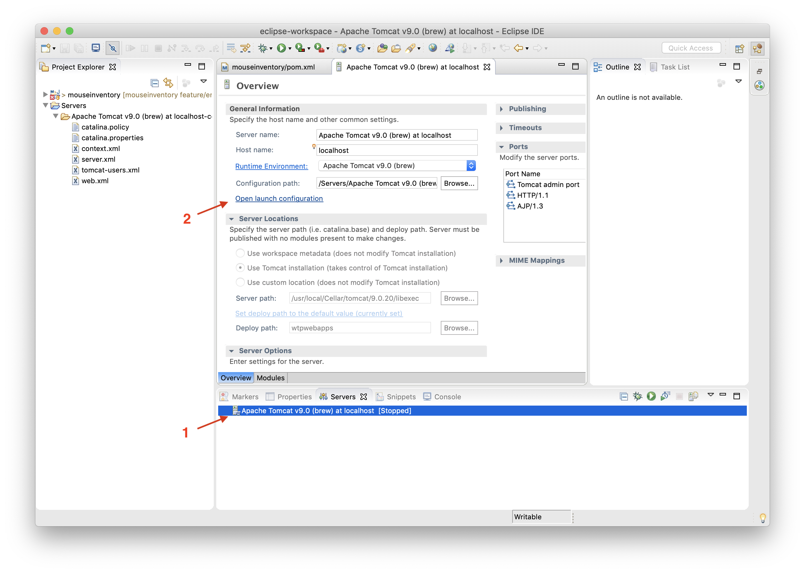
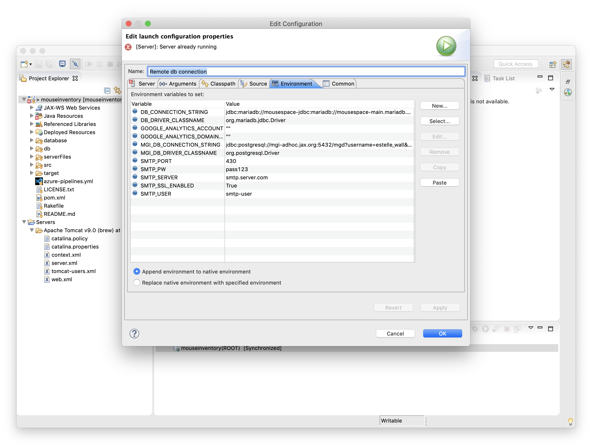

# Mouse Inventory Database

The mouse inventory database is an application for tracking an institution's inventory of mice for genetics research.


## Features

See the <a href="http://musIndex.github.com/mouseinventory">home page</a>

## Installation

See the installation <a href="https://github.com/musIndex/mouseinventory/wiki/Installation">wiki page</a>

## Developing

See the [development notes wiki](https://github.com/musIndex/mouseinventory/wiki/Development-notes) to learn about how to work with the code.

## Environment Variables

### DB_DRIVER_CLASSNAME
Classname of the driver for the main database. Typically `org.mariadb.jdbc.Driver`

### DB_CONNECTION_STRING
Connection string for the main databse, including the user and password `jdbc:mariadb://localhost:3306/mousespace?user=mousedb&password=abc123`

### MGI_DB_DRIVER_CLASSNAME
Classname of the driver for the main database. Typically `org.postgresql.Driver`.  Required but server will start with an invalid value.

### MGI_DB_CONNECTION_STRING
Connection string for the main databse, including the user and password `jdbc:postgresql://mgi-adhoc.jax.org:5432/mgd?username=mousedb&password=abc123`.  Required but server will start with an invalid value.

### SMTP_SERVER
The domain name (eg. `smtp.server.com`) of the SMTP server. Required but server will start with an invalid value.

### SMTP_USER
The username for connecting to SMTP server. Required but server will start with an invalid value.

### SMTP_PW
The password for connecting to SMTP server. Required but server will start with an invalid value.

### SMTP_PORT
The port used to connect to SMTP server. Required but server will start with an invalid value.

### SMTP_SSL_ENABLED
Either `true` or `false` (case-insensitive). Required but server will start with an invalid value.

### GOOGLE_ANALYTICS_ACCOUNT
_Optional_ The accont for Google Analytics.

### GOOGLE_ANALYTICS_DOMAIN_SUFFIX
_Optional_ The domain suffix used for Google Analytics.

## Setting environment variables

### Eclipse
Add the required environment variables to you your server environment. 


Open the server properties by double clicking on the server name. 
Click on "Open launch configuration..." to 


Open the "Environment" tab and click "New" to add new environment variables.
Click on save and restart your server.

### Brew
If Tomcat was installed using `brew`, then s straightforward way to add the requiste environment variables is to update the `homebrew-mxcl.tomcat.plist` file located in the `/usr/local/Cellar/tomcat/<version>/` directory. Open the file and add the following just before the closing `</dict></plist>` tags.

```xml
    <key>EnvironmentVariables</key>
    <dict>
      <key>DB_DRIVER_CLASSNAME</key>
      <string>org.mariadb.jdbc.Driver</string>
      <key>DB_CONNECTION_STRING</key>
      <string>jdbc:mariadb://localhost:3306/mousespace?user=mousedb&password=abc123</string>
      <key>MGI_DB_DRIVER_CLASSNAME</key>
      <string>org.postgresql.Driver</string>
      <key>MGI_CONNECTION_STRING</key>
      <string>jdbc:postgresql://mgi-adhoc.jax.org:5432/mgd?username=mousedb&password=abc123</string>
      <key>SMTP_SERVER</key>
      <string></string>
      <key>SMTP_USER</key>
      <string></string>
      <key>SMTP_PW</key>
      <string></string>
      <key>SMTP_PORT</key>
      <string>1</string>
      <key>SMTP_SSL_ENABLED</key>
      <string>1</string>
      <key>GOOGLE_ANALYTICS_ACCOUNT</key>
      <string></string>
      <key>GOOGLE_ANALYTICS_DOMAIN_SUFFIX</key>
      <string>True</string>
    </dict>
```

A sample `homebrew-mxcl.tomcat.plist` is [included in the repo](serverFiles/brew/homebrew.mxcl.tomcat.plist).